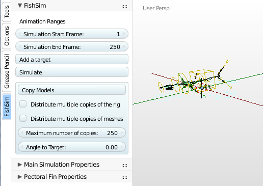

# FishSim - Goldfish Version

#### Fish Swimming Simulation   
V0.2.0 GoldFish Release

Addon Download: [FishSim.zip](https://github.com/nerk987/FishSim/releases/download/V0.1.0/FishSim.zip) 

## New in This Release
* New Goldfish Rigify metarig available when both FishSim and Rigify are enabled
* The simulation will now optionally allow the fish to 'hover' using pectoral fin oscillation and air bladder
* The new Pectoral Fin and Hover parameters are enabled when a rig created from the 'GoldFish' metarig is selected.

## Introduction
Most computer animation is done manually by setting keyframes at key points, and then tweaking intermediate frames. For some types of animation however, it should be possible for the computer to do the detail work once the animator has set up the appropriate environment. Bullet physics and the fracture modifier are examples. Physically based animation!

This addon aims to make it easier to animate natural movements of fish by allowing the animation of targets or proxies, and then simulating the movements required for the fish to follow these targets. It would be hard to support every type of rig that could be built for a fish model, but the shark metarig supplied with the built-in rigify addon provides a convenient standard that should be easy to apply to most models.

In the real world, fish often come in large numbers. There is already an impressive addon called Crowdmaster which is designed to move large numbers of objects according to complex strategies.  It's very well suited to setup an initial pattern for a school of fish and then animate the motion according to flocking, path following, object avoiding rules. In fact, it could handle the whole task including specifying armature actions to simulate swimming but the actions would end up somewhat robotic. Instead, it can be used to drive the motion of the targets, and the FishSim addon can then be used to produce realistic swimming physics for the 'actors' to follow the targets. An example crowdmaster setup suitable for this addon is provided. The 'animation nodes' addon is an alternative.

## Workflow summary
* Create or download a fish model
* Use the Rigify Shark, or FishSim/Rigify Goldfish metarig to rig the model (or download one of the example models)
* Install and enable the FishSim addon. The FishSim panel will be available while the fish armature is selected
* From the FishSim tools panel, add a target for the model
* Animate the target via keyframes, path follow etc to show the fish model where to swim
* From the FishSim tools panel, select the range of frames and select 'Simulate'
* Run the animation (Alt-A), and tweak the simulation parameters to provide the desired swimming action 

The above workflow can be used to animate as many fish models as you like. However, for large numbers, some additional steps can make this easier.

* Use the workflow above to create a fish model with a FishSim target object.
* Tweak the simulation parameters to suit the planned speed of the targets.
* Duplicate and animate the target as many times and with whatever tools you like. The Crowdmaster addon is very suitable, as is the Animation Nodes addon. 
* Select the 'Distribute multiple copies of the rig' option and then click on the 'Copy Models' button to make a copy of the fish armature at every target object location. Optionally limit the number of rigs to a small number using the 'Maximum number of copies' parameter to speed up the initial testing.
* Select the 'Simulate' option again to simulate the swimming action for every matching armature and every target object location. Again tweak the swimming simulation parameters.
* Select the 'Copy Meshes' option (and untick the other options) and use the 'Copy Models' button to make a copy of the fish mesh object(s) attached to the armatures at every target object location.

## Reference
### Installation
It's like just about every other Blender addon. Download the file here:

From the Blender file menu, choose 'User Preferences'. Switch to the 'Add-ons' tab, then select 'Install Add-on from file'. Browse to the location of the downloaded addon zip file. Enable 'FishSim' from the list of add-ons.

There should be a 'FishSim' tab on the Toolbar to the left of the 3D view whenever an armature is selected in object or pose mode.

### Rigify Shark Metarig

If you haven't used it, Rigify is a hugely powerful rig generator add-on that is supplied with Blender. When enabled, the 'Add Armature' menu is extended to allow the creation of various metarigs. It now supports a 'Shark' metarig, and after you adjust the metarig to suit your model, Rigify can generate a fully functioning control rig. 

The FishSim add-on doesn't need Rigify to be installed to work, but it does expect the rig to have been generated with Rigify from the standard Shark metarig. You can download a shark model rigged in a suitable way from here:  or make your own. Even if you have a model rigged using a different method, it should be quite easy to re-rig it using Rigify.

One thing I've found with this rig is that it looks better if the 'curvature' parameter on the top and bottom part of the tail fin is set to 1.0 (makes the bendy bones fully bendy). Also the Head, Neck and Tail 'Follow' paramters should be set to 1.0 or at least fairly high.

### FishSim Tools Panel
Once FishSim is loaded and enabled, a FishSim tab should appear on the Tool Panel on the left of a 3D view if an armature is selected in Pose or Object mode. The tab contains a 'FishSim' panel and a 'Simulations Properties' panel 

1. Animation Range

>The swimming motion of the fish armatures will be animated by setting keyframes between the 'Simulation Start Frame' and the 'Simulation End Frame'.

2. Add a Target

>The 'Add a Target' button will add a 'Target Proxy' object set to the bounding box size of the armature, and with wire frame display enabled. The idea then is to animate the motion of the Target Proxy, and then the fish armature can be automatically simulated to follow the target. 

>A 'custom property' is added to the root bone of the fish armature so that the fish knows which target to follow. The Target Proxy also gets a custom property to identify it, and this tag includes the first three letters of the rig - we'll mention this later as it helps when you have different types of fish.

3. Simulate

> The Simulate function will animate various bones within the rig and add a keyframe for each frame in the animation range. The animation will try to make the rig swim in a realistic way to keep pace with the target animation, according to a number of parameters which can be adjusted in the operator re-do panel. If there are multiple rigs in the scene with the same first three characters in the name, all of the rigs will be animated. This applies specifically to the rigs generated by the following functions.

4. Simulate for multiple targets

>4.1. Distribute Multiple Copies of the Rig

>If this option is ticked, when the 'Copy Models' button is pressed the addon will search for every target in the scene that matches the currently selected armature. For each target, a copy of the currently selected armature will be positioned at the target's location and rotation, and linked to follow that target. The armature root bone will be scaled to match the targets scale. If an armature is already linked to that target, it's position, rotation, and root bone scale is re-adjusted to match the target. All of the copied armatures are left selected to make them easier to delete or be moved to other layers.

>4.2. Distribute Multiple Copies of meshes.

>If this option is ticked, when the 'Copy Models' button is pressed the addon will search for every target in the scene that matches the currently selected armature. For each target that has a linked armature, a copy of all the mesh children of the currently selected armature will be attached to the associated armature and linked.  All of the copied meshes are left selected to make them easier to delete or be moved to other layers.

>4.3. Maximum number of copies

>The maximum number of armatures or meshes copied and/or simulated can be limited by this parameter to simplify the process of tuning the swimming action to the animated targets.

>4.5. Angle to target

>I found that most of the Crowd Master examples moved the objects in the positive Y direction by default, and Rigify and most models face the negative Y direction. This parameter lets you add a rotation offset when the armatures are attached to the targets. If you find your models start swimming in the opposite direction to the target, put 180.0 in this parameter.

### Simulation Parameters

>Parameters affecting the swimming action of the fish can be found in the 'Simulation Parameters' panel after running the simulation. They can be adjusted as required to allow the model to better follow the target. The parameters are saved with the blend file, and different sets of parameters can be saved using the presets control.

>There are a lot of parameters, but in most cases only a have to be changed. I would suggest you setup a single armature with a target animated to move at a steady speed. Run the simulation for say 100 frames. If the model lags behind the target, decrease the tail 'Stroke Period' (flap faster) and/or increase the 'Power' (more push per tail flap). If the model overshoots the target repeatedly, or loops in a 360, do the opposite. To make the model turn faster, increase the 'Turn Assist' parameter.

>The 'Mass' and 'Drag' parameters can be adjusted to affect the stopping speed, and the steadiness of the movement.

### Simulation Parameter Reference

* Mass

>A higher value will make the motion steadier. A lower value will cause the speed to pulse as the tail moves back and forwards.

* Drag

>A higher value will allow the fish to stop quicker and may cause the speed to pulse. A higher 'Power' will be needed to obtain the same top speed. A lower value will allow the fish to glide with little tail movement.

* Power

>Is the amount of forward force for a given tail movement. A higher value will give a higher top speed. A value too high or low will look unrealistic.

* Stroke Period

>When the fish needs maximum speed to keep up, this paramter sets the number of frames per flap of the tail. The smaller the number, the faster the flapping. The faster the flapping, the faster the fish will move.

* Effort Gain

>The further from the target, the faster and bigger the tail will flap. The larger this value, the faster the fish will swim for the same distance from the target. If it's too big, the fish will overshoot repeatedly, too small and the fish will lag. A value of 0.2 will normally suit, a bit bigger if you want the fish right up on the target.

* Effort Integral

>Similar to the Effort Gain, but takes into account how long the fish has been lagging.

* Effort Ramp

>This affects how long it takes the fish to wind up an down. A large shark will have a slow ramp. A value of 1.0 is instantaneous, while a value of 0.05 is quite slow.

* AngularDrag

>A low Angular Drag will cause the direction of the fish to 'zig zag' as the tail flaps, while a high value will make the direction unaffected by every flap. The amount of direction movement also depends on the Stroke Period and Max Tail angle.

* TurnAssist

>A high value will allow the fish to turn fast if required, and low value will give a large turning circle. Tune this value to allow the fish to track the target while still being realistic.

* Max Tail Angle

>This is the angle in degrees that the tail moves from side to side during periods of maximum effort. A larger value will give a higher maximum speed.

* Max Steering Angle

>This is the additional tail angle used to steer the fish

* Max Vertical Angle

>This parameter is the most angle change in degrees that can occur in the vertical direction (ie up and down) every frame. A bigger value will give a faster response to up and down changes in the target motion.

* Max Tail Fin Angle

>The maximum angle in degrees that the tip and the top of the tail fin can move due to water resistance as the tail goes from side to side. Combined with the Tail Fin Gain and Tail Fin Stiffness parameters determines how stiff or floppy the tail fin is.

* Tail Fin Tail Fin Phase

>This parameter represents the drag of the tail fin tip. The tip of the tail fin will lag behind the main part of the fin, and this lag is represented in degrees. 90 degrees should be about right, but it can be adjusted a bit up or down if the 'floppiness' of the tail fin doesn't look right.

* Tail Fin Stiffness

>The stiffness is the force trying to return the fin tip to the original shape. A value of 1.0 will be very stiff, a value of 0.1 will be very bendy.

* Tail Fin Stub Ratio

>A value of one will make the lower part of the tail fin respond the same as the top part. A value of 0.5 will make the lower part of the tail fin move half as much. This is suitable for a shark tail where the top tip of the tail fin is bigger and longer.

* Max Side Fin Angle

>Like the tail fin, but for the large side fins .

* Side Fin Phase

>Like the tail fin, but for the large side fins 

* Chest Ratio

>As the tail moves from side to side, the chest and head will also move. If the ratio is 1.0, the movement will be the same as the tail. A factor of 0.5 will make the chest angle half that of the tail.

* Chest Raise Factor

>As the fish turns, it's natural for the head and chest to arch up. A value of 0.0 will cause no effect. A larger value will determine how much chest/head raise occurs.

* LeanIntoTurn

>This paramter affects how much the fish leans into a turn. A factor of 0.0 will be no lean.

* Random

>A number of the parameters can be adjusted by a random factor. If this parameter is 0.0 then there is no random influence. The default figure of 0.25 allows paramters including the Max Tail Angle and Power to be adjusted up or down as much as 25%. This is useful when simulating a school of fish to give variation in speed and turning.

 

 

